CUDA Path Tracer
================

**University of Pennsylvania, CIS 565: GPU Programming and Architecture, Project 3**

* Name: Vaibhav Arcot
  - [LinkedIn](https://www.linkedin.com/in/vaibhav-arcot-129829167/)
* Tested on: Windows 10, i7-7700HQ @ 2.8GHz (3.8 Boost) 32GB, External GTX 1080Ti, 11G (My personal laptop)

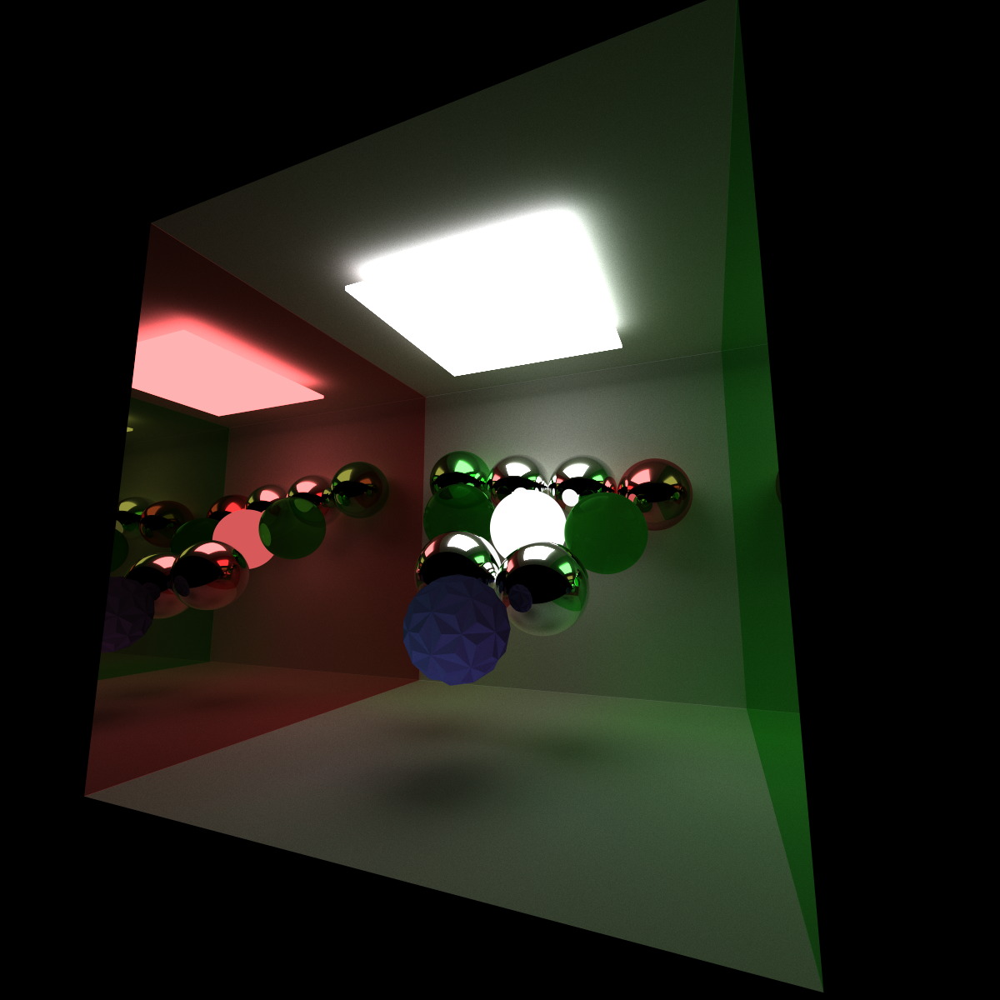

## Path Tracing overview

This repo is a path tracer written entirely in C++ and CUDA accelerated. The idea of a path tracer is to simulate the effect light and materials have on other objects in the scene. 

All images shown were created by running 5000 iterations unless otherwise specified, and all scene files and meshes are provided

### Dependencies & CMake changes

* CUDA 10+
* [tinyobjloader](https://github.com/syoyo/tinyobjloader) (Included in repo)
* Added *common.h* to the CMakeList.txt

### Features
* Reflective and diffused materials
* Stream compaction
* Material sorting
* Caching first bounce
* Refractive materials using Schlick's approximation of Fresnel's law
* Motion blur
* Anti Aliasing
* Normal debugging view
* Loading arbitrary meshes and ray culling
## Cornell Box

The Cornell box is a simple stage, consisting of 5 diffusive walls (1 red, 1 green and the other 3 white). In the above sample, a diffusive sphere.

## Different Materials

Below is an image with the 4 types of materials inside a Cornell box. The small dodecicosacron is a diffusive material, one orb is reflective and one is transparent. Finally, a cube is used as a light for the scene.

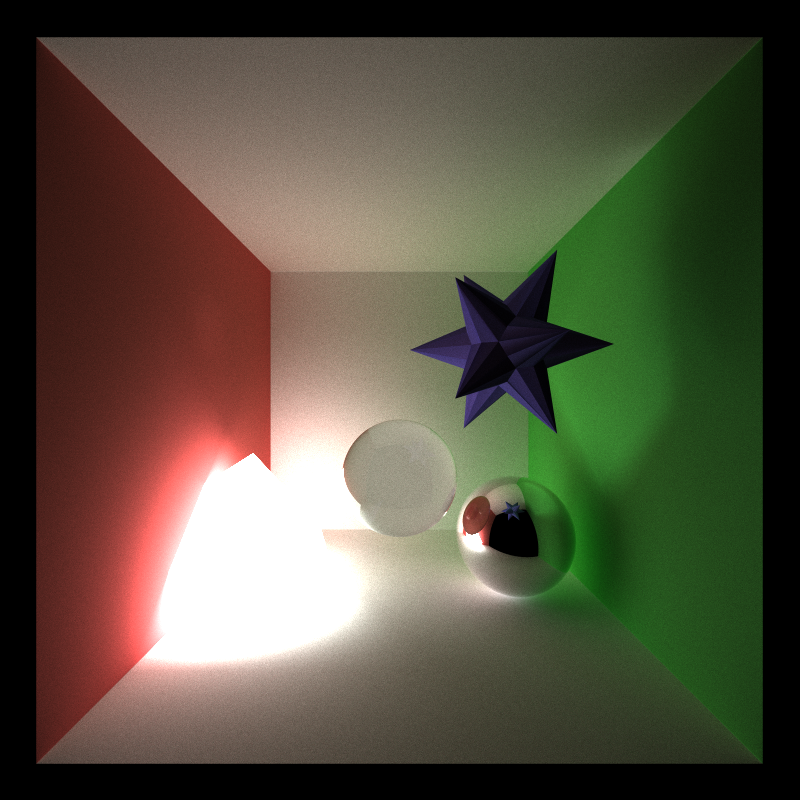

## Effects

### Motion blur
To perform motion blur, we move the object slightly by some velocity each time we render a frame. This gives the illusion of motion. To showcase this feature, I decided to pull down the red and green walls of the Cornell box. Each wall had a constant velocity going down and stopped once they reached a point. Just for fun, I decided to put a light source inside the transparent orb.
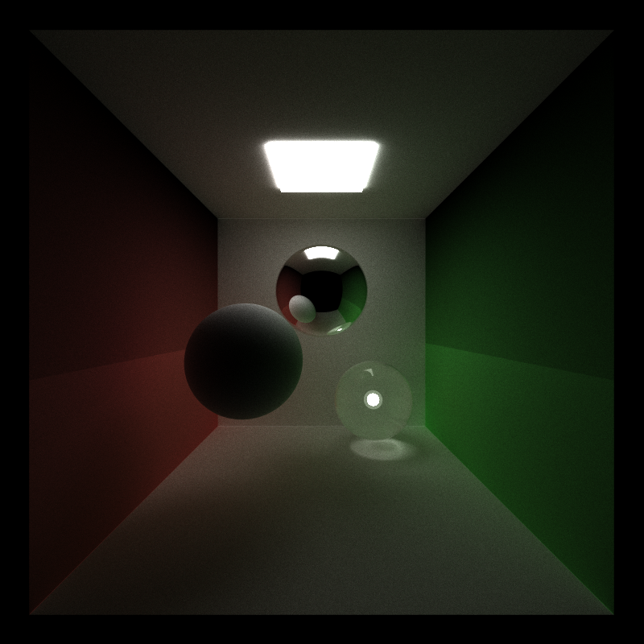

### Anti Aliasing

To perform anti-aliasing, I decided to use the simple approach of jittering the ray within the pixel every time we generate the rays for that scene. This prevents the ray from having the same first bounce, which can otherwise make the edges of objects appear jagged (aliasing, shown in the zoomed versions below).

| 
 <b>Anti Aliasing Off </b>
 | 
 <b>Anti Aliasing On </b>
|
| ---- | ---- |
|   |      |
| 
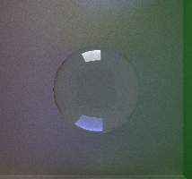
 | 
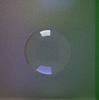
 |

### Fresnel's Effect

Fresnel's effect is the idea that even a refractive material has a reflective quality to it (based on the incident ray angle). To approximate this effect, Schlick's approximation was used. The results are shown below (the diffuse object is shown for orientation context).

| 
 Transparent object with Fresnel's effect Off </b>
 | 
 <b>Transparent object with Fresnel's effect On </b>
 |
| ------------------------------------------------------------ | ------------------------------------------------------------ |
| 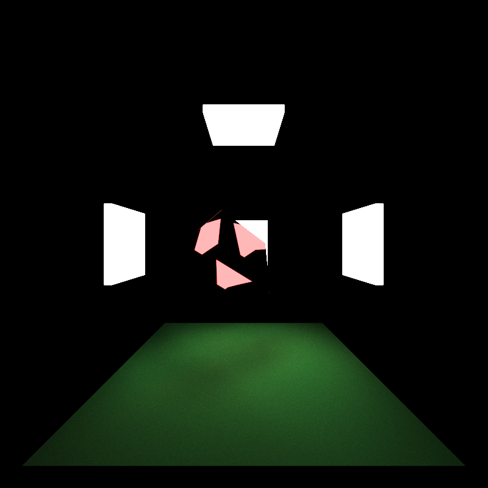                |                   |
| 
 Diffused object </b>
                  | 
 Reflective object </b>
                |
|  |  |

### Meshes

Mesh loading is supported in this path tracer with the help of *tinyobjloader*. The implementation allows for a mesh to have a rotation, translation and scale added to it, and also allows the importing of mesh files that have or lack normals defined inside them. Currently, only triangular meshes are supported, but the code should be easy to extend to higher-order polygons.

#### Great Dodecicosacron

This mesh is one of the first meshes I was able to load and render (Besides a debugging square). This mesh has 360 vertices and 120 faces, with the material used, was a reflective dark blue colour with a refractive index of 1.33. As mentioned previously, all scene files are present in the scenes/Scenes folder.

#### Elephant

Below is a mesh of an elephant with a diffused red surface (and diffused white ground). This mesh has 623 vertices and 1148 faces.

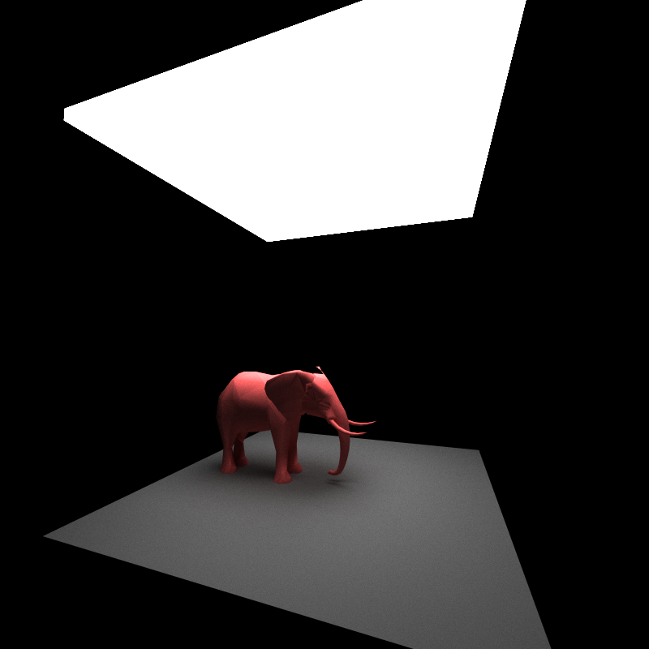

#### Stanford bunny

In the aim of pushing the system to its limits, I decided to load up the Stanford bunny. The material is a dark refractive material (It has a metallic quality only because it is hard to figure out if you are seeing a reflection or refraction which I like). This model has 34,817 vertices and 69,630 faces.

#### Stanford dragon

Finally, I decided to load the Stanford dragon mesh. This mesh has a staggering (for me) 435,545vertices and  871,306 faces. Due to time limitations, I was only able to run this for 2.5k iterations, and an octree or KD-tree would have added a massive speed up (Future work).

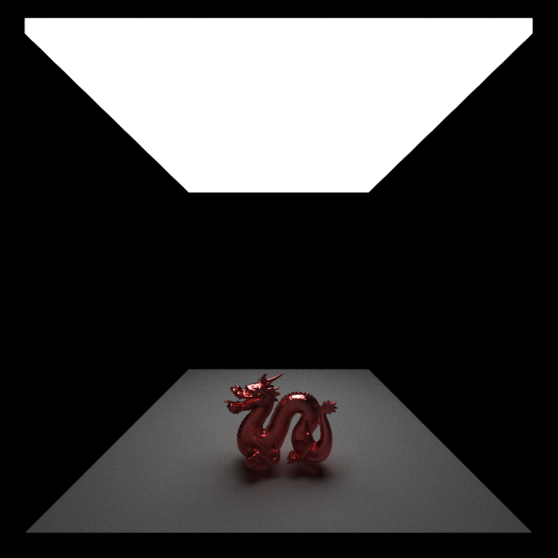

### Debugging Normal view

To debug the mesh normals, I ended up implementing a simple normal view mode. In this mode, each surface is coloured by the absolute value of their normal. Thus, if the surface is a roof (or floor), it will have a normal in the y-axis (0, 1, 0) and thus be coloured in green  (RGB colouring). below is a sample image of a tilted cube (made of triangles) with the faces coloured using the normals. 

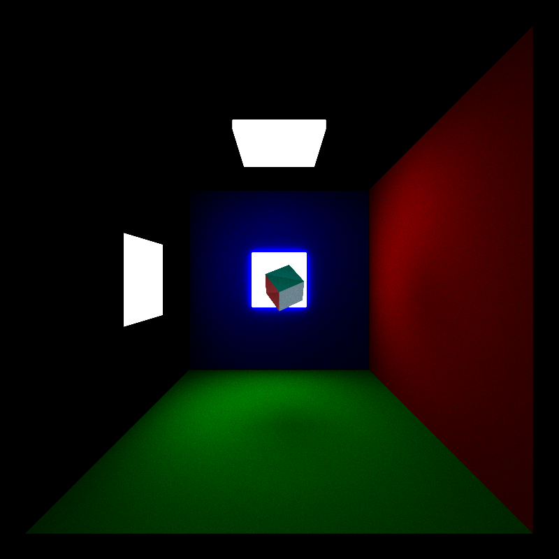

## Optimizations

### Stream Compaction

One of the first optimizations was to stop bouncing terminated rays. This reduces the number of threads we need to spawn each bounce (after each bounce, rays terminate by hitting either a light source or into the void). To do this, I used thrust::partition to split the array by their completion state (completed rays are moved to the end). Then the number of rays to bounce is reduced and the main bounce loop is run again. Once the entire process has finished, we just need to reset the number of rays (so that everything is used to create the final image). The performance improvement is shown below:

### Material Sorting

The idea of material sorting is to reduce warp divergence. To implement this, I decided to go with thrust::sort_by_key, where the key is the material type. The results of this are shown below, but the key point is that it performs worse than not doing it. This could be because warp divergence occurs in my implementation (because of the probabilistic reflection refraction) and the small cases where it does reduce divergence doesn't justify the added overhead of sorting the rays (and intersections).

### Caching first bounce

First bounce caching is the idea to not recomputing the first bounce every time we start a new iteration because the initial rays will always start from the same place (not true after 1 bounce). Some important things to note, this optimization cannot be used with the anti-aliasing technique implemented here because that would jitter the initial ray, thus changing its first bounce location. This optimization also cannot be used with motion blur, because the object changes its position after every frame rendered (making the previously cached bounce incorrect). Both these cases are asserted in the code to prevent them from happening.

### Bounding box ray culling

The final optimization is for collision detection with meshes. Each of the meshes loaded had a LOT of polygons, and checking each ray with each polygon would quickly become impossible to run in any reasonable time. As a first optimization, a bounding box around the mesh is created during the time of loading. Then this bounding box is used as the first check for collision. This allows a significant number of rays to be discarded (only if the object is small).

### Results

To test the optimizations, I ran 500 iterations on 2 difference scenes (below). Both scenes contain a mesh object (including the cube) to be able to test the ray culling optimization. The second scene was created to allow a good number of the rays to be compacted.

|                 Scene 1 after 500 iterations                 |                 Scene 2 after 500 iterations                 |
| :----------------------------------------------------------: | :----------------------------------------------------------: |
|  |  |

The runtimes for each optimization (alone) has been shown below. The best-case option is the case where the optimizations that help are turned on (Ray culling and Caching). 

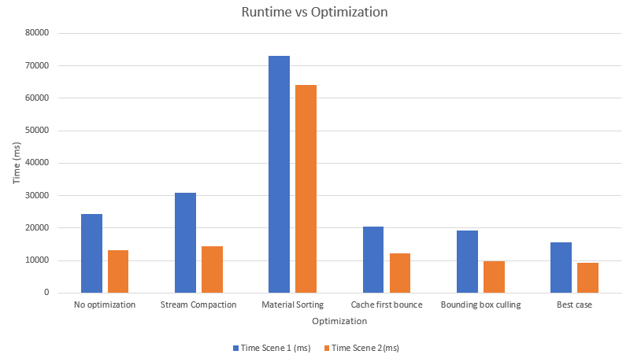

From the above plots, we can see that material sorting doesn't improve performance. Stream compaction comes close to improvement but is slightly more expensive. I believe this is because thrusts implementation of partition isn't optimal. Another reason is that it is scene dependent. The more rays we can mark as terminated the better stream compaction will be.

Bounding box culling did extremely well and would scale well with the increase in complexity of the mesh. Caching also works well but has the issue that it cannot be used with the anti-aliasing technique chosen.

## Other cool results

### Re computing normals makes it more jagged

Normals are assigned to each of the vertices of the polygon in a mesh (not to the face itself). Then to find the normal of a point on the face, we can interpolate the normal using the barycentric coordinates. This results in a smoother look to the edges.

 While loading a *.obj* model, not all of them come with the normals precomputed, so to solve this, I included a simple normal calculation mode. Though it works, it isn't ideal because while calculating the normals for the vertices, I only use the 3 edges/vertices of that face (and take the cross product) and set all the 3 vertex normals to this same value.

The issue is that the resultant model will be jagged at the internal edges. Below is a comparison of using the normals created using a program (CAD Exchanger) vs calculating them myself (It looks kinda cool actually). The solution would be to find all the faces attached to a vertex and then compute the normal using a mean of all the faces, but this has been left for the future. 

This is only noticeable for low polycount objects. For the dragon shown above, I had to compute the normals using my approximation and I couldn't tell the difference.

| Existing normals                                | Approximation of normals                       |
| ----------------------------------------------- | ---------------------------------------------- |
| 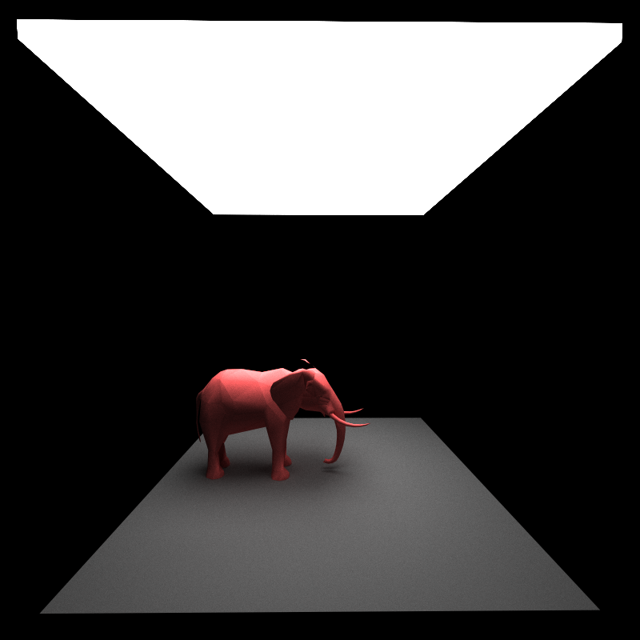 | 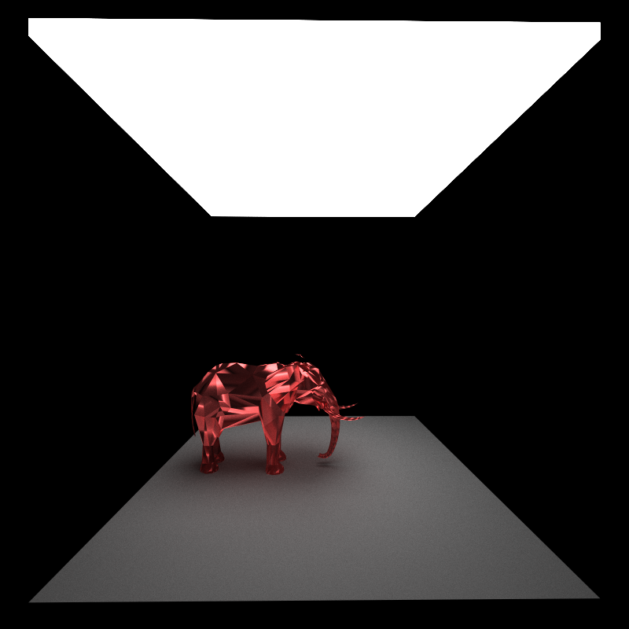 |

### Effect of depth on a render

To show the effect of depth on the render, I decided to render a reflective intensive scene. 2 of the walls (red and green) and 6 orbs are reflective, 2 light sources (one is the middle orb), 2 transparent (green) orbs and 1 orb(blue) + 3 walls are diffusive. Because of this setup, the number of remaining rays doesn't reach 0 by a depth of 8, meaning there can be a further improvement (in deeper reflections).

| Depth | Render                  | Comment                                                      |
| ----- | ----------------------- | ------------------------------------------------------------ |
| 1     |   | For this render, we see no reflections at all. The no path tracing case. |
| 2     | 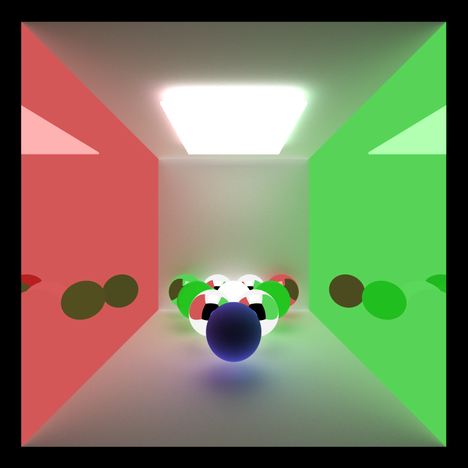  | We start to see some reflections (only the simplest ones).   |
| 3     |   | We can see more reflections on the reflection of the orbs in the walls. |
| 4     |   | We now have better refractions.                              |
| 5     |   | The reflections of the orbs have some transparency.          |
| 6     |  | The reflection of the transparent orbs isn't transparent.    |
| 7     |  | The difference is subtle, but is shows up in the 3rd order reflections |
| 8     |   | We can keep going, but here is a good stopping point.        |

 

### Effect of iterations on a render

To see the effect of iterations on render quality, I went with the same image I used above (with a depth of 8) to test the effect of iteration on render for a semi-complex scene. From visual inspection, 2000 seems to be the tipping point, and further iterations have diminishing value.

| Iterations | Render                   |
| ---------- | ------------------------ |
| 50         |    |
| 250        |   |
| 500        |   |
| 1000       |  |
| 2000       | 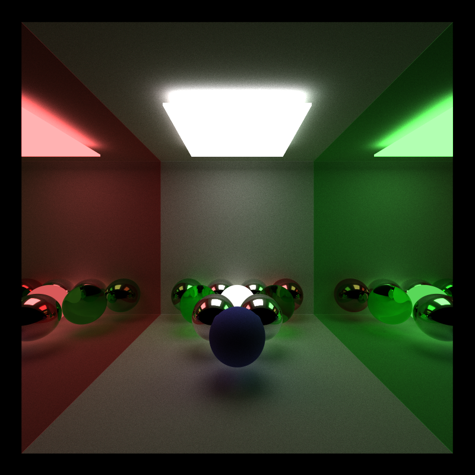 |
| 5000       |  |

## Observations

### Material sorting is slow

I mentioned this before, but sorting is slow! Maybe using my radix implementation (which seemed to outperform thrusts implementation by a lot) could overcome this

### Creating meshes with normals  helps

Finding meshes with normals or creating them using CAD Exchanger saved time during the initial phases, by reducing the number of things to debug (not really, but kind of).

## Bloopers

For the first blooper, this was in the very early stages where the floor and ceiling were reflective, and stole the colour from the right and left wall and light.

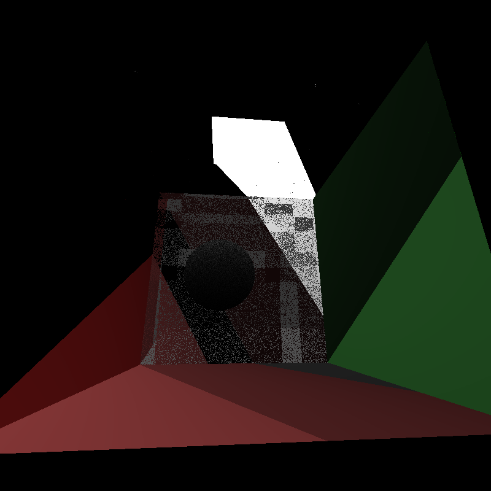

For the next stumble, for a long time, I couldn't figure out why my roof was black. Then I understood I was double adding colours (which made the walls very vivid) and also having a bug in the loop termination condition.

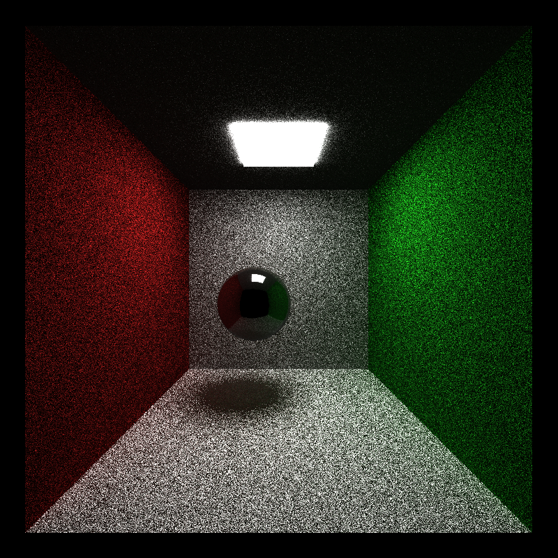

## Useful links

[3D obj files with normals](https://casual-effects.com/data/)

[Fresnel's law](https://blog.demofox.org/2017/01/09/raytracing-reflection-refraction-fresnel-total-internal-reflection-and-beers-law/)

[Easier 3D obj files](https://graphics.cmlab.csie.ntu.edu.tw/~robin/courses/cg04/model/index.html)